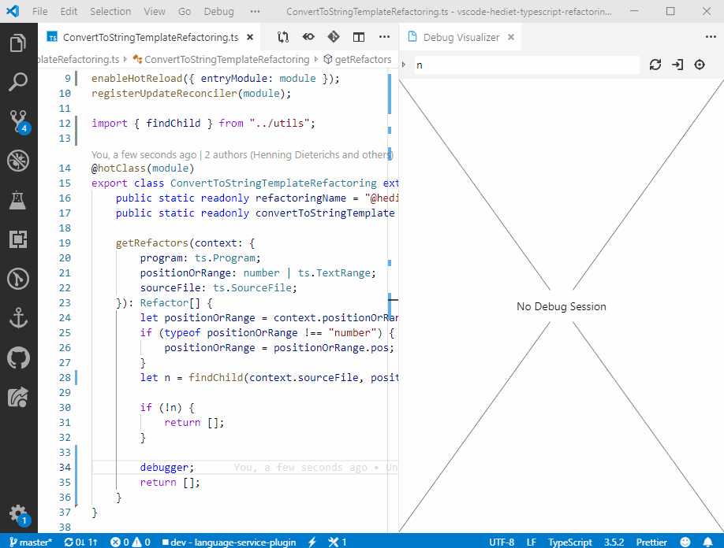

This post is about how to implement a simple refactoring for TypesScript as a language service plugin that can be used in VS Code.
It showcases modern development techniques like hot reloading, test driven development and syntax tree visualizations in VS Code.

## Goal

When I want to pass a textual message to a function, I often start with a simple string literal enquoted in `"` but then notice that I want to include non-static variables.
However, rather than just concatenating the various string parts, I prefer to use string templates for that.
The goal of this post is to implement a refactoring that can convert from manually concatenated strings to string templates:

```ts
format("Hello " + name);

// After applying "Convert to template string":
format(`Hello ${name}`);
```

## Figuring out how to write a Language Service Plugin

I used [Writing a Language Service Plugin](https://github.com/microsoft/TypeScript/wiki/Writing-a-Language-Service-Plugin) as a starting point for a language service plugin.
With the help of autocompletion, I soon spotted `getApplicableRefactors` and `getEditsForRefactor` as the two functions of the language service to decorate for custom refactorings.

By using `getProgram` of the underlying lanugage service, the plugin can access the current syntax tree and the type checker.

I ended with the following project structure:

```ts
// src/index.ts: Entry point of the plugin, automatically loaded by the language server.
import * as ts from "typescript/lib/tsserverlibrary";
import { createDecoratedLanguageService } from "./createDecoratedLanguageService";

export = function init(modules: { typescript: typeof ts }) {
    return {
        // Is called by the TypeScript language server to get the decorated language service.
        create(info: ts.server.PluginCreateInfo): ts.LanguageService {
            // At runtime, use `modules.typescript` rather than importing "typescript".
            // This avoids version conflicts, in particular when new AST kinds are added.
            // Types however still must be imported from "typescript".
            return createLanguageServiceWithRefactorings(
                modules.typescript,
                info.languageService,
                info.project.projectService
            );
        }
    };
};
```

```ts
// src/createLanguageServiceWithRefactorings.ts
import * as ts from "typescript";

export function createLanguageServiceWithRefactorings(
    typescript: typeof ts,
    base: ts.LanguageService
): ts.LanguageService {
    return {
        ...base,

        getApplicableRefactors: (fileName, positionOrRange, preferences) => {
            const existing = base.getApplicableRefactors(
                fileName,
                positionOrRange,
                preferences
            );
            const refactorings = [];
            const program = base.getProgram();

            // TODO

            return [...refactorings, ...existing];
        },

        getEditsForRefactor: (
            fileName: string,
            formatOptions: ts.FormatCodeSettings,
            positionOrRange: number | ts.TextRange,
            refactorName: string,
            actionName: string,
            preferences: ts.UserPreferences | undefined
        ): ts.RefactorEditInfo | undefined => {
            const e = base.getEditsForRefactor(
                fileName,
                formatOptions,
                positionOrRange,
                refactorName,
                actionName,
                preferences
            );
            if (e) {
                return e;
            }
            const program = base.getProgram();

            // TODO

            return undefined;
        }
    };
}
```

And finally the file where the actual refactor logic should be implemented:

```ts
// src/ConvertToStringTemplateRefactoring.ts
export class ConvertToStringTemplateRefactoring {
    public static readonly refactoringName = "@hediet/ts-refactoring-lsp";
    public static readonly convertToStringTemplate = "convertToStringTemplate";

    // TODO
}
```

## Setting up Test and Debugging Environments

When programming against a very large and not very well documented API such as TypeScripts compiler API,
it is important to be able to test things quickly. Besides, it is very useful to have an easy way to attach a debugger.
I can recommend using Mocha and the Mocha Test Explorer for VS Code, which allows to run and debug arbitrary tests with a single click.

For testing, we need to mock a language service host, so we can easily define virtual TypeScript files.
We also want to have a way to specifiy markers in our virtual files
so we don't have to compute positions where to apply the refactoring by ourselves.
This can be implemented in a way so that the actual tests can be expressed like this:

```ts
// test/main.test.ts
import {
    testSingleFileLanguageService,
    expectRefactoring,
    expectNoRefactoring
} from "./utils";
import { ConvertToStringTemplateRefactoring } from "../src/ConvertToStringTemplateRefactoring";
import { createLanguageServiceWithRefactorings } from "../src/createLanguageServiceWithRefactorings";
import ts = require("typescript/lib/tsserverlibrary");

describe("convertStringConcatenationToStringTemplate", () => {
    const action = {
        refactoringName: ConvertToStringTemplateRefactoring.refactoringName,
        actionName: ConvertToStringTemplateRefactoring.convertToStringTemplate
    };

    const decorateWithRefactorings = (base: ts.LanguageService) =>
        createLanguageServiceWithRefactorings(ts, base);

    describe("Expect Refactoring", () => {
        // "|" is used as marker for where to trigger the refactoring.
        // `testSingleFileLanguageService` calls mocha's `it` with the program as name.
        testSingleFileLanguageService(
            `const str = "|hello";`,
            decorateWithRefactorings,
            expectRefactoring(action, "const str = `hello`;")
        );
        testSingleFileLanguageService(
            `const str = ("hello" |+ i) + 1;`,
            decorateWithRefactorings,
            expectRefactoring(action, "const str = `hello${i}${1}`;")
        );
        // ...
    });

    describe("Expect No Refactoring", () => {
        testSingleFileLanguageService(
            `const str = "test";|`,
            decorateWithRefactorings,
            expectNoRefactoring(refactoringName)
        );
        testSingleFileLanguageService(
            `const str = (1 + "hello" |+ i) + 1;`,
            decorateWithRefactorings,
            expectNoRefactoring(refactoringName)
        );
        // ...
    });
});
```

`testSingleFileLanguageService` is implemented as follows:

```ts
// test/utils.ts
// ...
type TestFn = (
    service: ts.LanguageService,
    markers: number[],
    mainFile: { name: string; content: string }
) => void;

/**
 * Describes a test for a given content with markers.
 * Prepares services and calles `testFn` to do the actual testing.
 */
export function testSingleFileLanguageService(
    content: string,
    decorator: (base: ts.LanguageService) => ts.LanguageService,
    testFn: TestFn
): void {
    it(content, () => {
        const main = stripMarkers(content);
        const mainFile = { name: "main.ts", content: main.stripped };
        const files = new Map<string, string>([
            [mainFile.name, mainFile.content]
        ]);
        const serviceHost = new MockLanguageServiceHost(files, {});
        const baseService = ts.createLanguageService(
            serviceHost,
            ts.createDocumentRegistry()
        );
        const decoratedService = decorator(baseService);
        testFn(decoratedService, main.markers, mainFile);
    });
}
// ...
```

See [`utils.ts`](https://github.com/hediet/hediet-ts-refactoring-lsp/blob/682fc9e55426ab48b98a1a929607c149342f7abb/language-service-plugin/test/utils.ts) for the remaining implementations.

## Abstractions

At this point, we need to fix the todos in `getApplicableRefactors` and `getEditsForRefactor`.

In our case, for `getApplicableRefactors`, we need to identify the node at the given position
that can be converted into a string template.
For `getEditsForRefactor`, we also have to identify the node that should be refactored
and compute the edits that apply the refactoring.

To factor out the common identification of the node where the refactoring should be applied,
or generally to maintain context between `getApplicableRefactors` and `getEditsForRefactor`,
it seems an abstraction for how to implement refactorings might be useful. Ideally, `getApplicableRefactors` returns a function that provides the edits together with each returned refactoring. An abstraction like this does that:

```ts
// src/RefactorProvider.ts
import * as typescript from "typescript";

export abstract class RefactorProvider {
    constructor(
        protected readonly ts: typeof typescript,
        protected readonly base: typescript.LanguageService
    ) {}

    /**
     * @param filter The filter that is applied to the returned refactors.
     * Can be used for performance optimizations.
     */
    abstract getRefactors(
        context: {
            program: typescript.Program;
            range: typescript.TextRange;
            sourceFile: typescript.SourceFile;
        },
        filter: RefactorFilter
    ): Refactor[];
}

export interface RefactorFilter {
    refactorName?: string;
    actionName?: string;
}

export interface Refactor {
    name: string;
    description: string;
    actions: RefactorAction[];
}

export interface RefactorAction {
    name: string;
    description: string;
    getEdits(
        formatOptions: ts.FormatCodeSettings,
        preferences: ts.UserPreferences | undefined
    ): ts.RefactorEditInfo | undefined;
}
```

Given a `RefactorProvider`, implementing `getApplicableRefactors` and `getEditsForRefactor` should be easy now.
The implementation can be found [here](https://github.com/hediet/hediet-ts-refactoring-lsp/blob/682fc9e55426ab48b98a1a929607c149342f7abb/language-service-plugin/src/Refactorings/createLanguageServiceWithRefactorings.ts).

## Implementing a RefactorProvider

In this phase it is extremely useful to have hot reloading and a way to easily attach a debugger.
`@hediet/node-reload` is a library that provides a fully featured hot reloading solution for Node JS.
[The Mocha Test Explorer Extension](https://marketplace.visualstudio.com/items?itemName=hbenl.vscode-mocha-test-adapter) for VS Code provides an easy way to debug mocha tests:


Alternatively, you can use my library [easy-attach](https://github.com/hediet/easy-attach) that works even without VS Code.

Equipped with hot reloading, the core class now looks like this:

```ts
// src/ConvertToStringTemplateRefactoring.ts
import {
    hotClass,
    enableHotReload,
    registerUpdateReconciler
} from "@hediet/node-reload";
import * as ts from "typescript";
import { RefactorProvider, Refactor } from "./RefactorProvider";

enableHotReload({ entryModule: module });

// Automatically reloads the new module when it changed
registerUpdateReconciler(module);

// Marks all methods of the class as hot.
// Hot methods are automatically restarted
// when they have been changed while being executed.
@hotClass(module)
export class ConvertToStringTemplateRefactoring extends RefactorProvider {
    public static readonly refactoringName = "@hediet/ts-refactoring-lsp";
    public static readonly convertToStringTemplate = "convertToStringTemplate";

    getRefactors(
        context: {
            program: ts.Program;
            range: ts.TextRange;
            sourceFile: ts.SourceFile;
        },
        filter: RefactorFilter
    ): Refactor[] {
        // todo
        debugger;
        return [];
    }
}
```

For hot reloading to work with TypeScript, `tsc` must be started in watch mode (or alternatively `ts-node` can be used).

At this point, we can already start debugging the tests.
As you can see, if the currently executed method is changed, it is simply reexecuted when continuing.
This is almost like an inline playground for refactorings:



The actual implementation is easy now.

First, we need to find out which smallest AST node spans `range`,
then we navigate the AST tree upwards until our parent is neither a binary (`+`) nor a parenthesized expression.
Then we traverse all descendants of that node to collect the parts of the final template string.
We then suggest the refactoring if at least one of these parts is a string literal:

```ts
getRefactors(context: {
    program: ts.Program;
    range: ts.TextRange;
    sourceFile: ts.SourceFile;
}): Refactor[] {
    let child = findInnerMostNodeAt(context.sourceFile, context.range.pos);
    if (!child) { return []; }

    const node = this.getSuitableOuterMostParent(child);
    const parts = this.getParts(node);

    if (parts.kind !== "stringLiteralSequence") {
        return [];
    }

    const action: RefactorAction = {
        description: "Convert to String Template",
        name: ConvertToStringTemplateRefactoring.convertToStringTemplate,
        getEdits: (formatOptions, preferences) => {
            return this.getEdits(
                context.sourceFile,
                node,
                parts.parts
            );
        },
    };

    return [
        {
            name: ConvertToStringTemplateRefactoring.refactoringName,
            description: "Convert to String Template",
            actions: [ action ],
        },
    ];
}
```

The remaining implementation can be read [here](https://github.com/hediet/hediet-ts-refactoring-lsp/blob/682fc9e55426ab48b98a1a929607c149342f7abb/language-service-plugin/src/Refactorings/ConvertToStringTemplateRefactoring.ts).

## Enabling the plugin

To enable the plugin, simply distribute it via npm, install it as dev dependency and add it to the project's tsconfig file:

```json
{
    "compilerOptions": {
        "plugins": [{ "name": "my-ts-plugin" }]
    }
}
```

It should now be available in most IDEs (like VS Code or Webstorm)!

## Distribute the plugin via a VS Code Extension

For distributing the plugin via an VS Code extension, simply add a `typescriptServerPlugins` key to the `contributes` section of the `package.json` of your VS Code extension. The name refers to the name of the plugin's `package.json` which must be added as a dependency to your extension.
Since `vsce` does not consider yarn workspaces, you have to publish your plugin first to npm and then install it as dependency to your VS Code extension.

```json
{
    // ...
    "contributes": {
        "typescriptServerPlugins": [
            {
                "enableForWorkspaceTypeScriptVersions": true,
                "name": "@hediet/ts-refactoring-lsp"
            }
        ]
    }
    // ...
}
```

## Outlook

Language service plugins can do much more.
They provide an easy way to implement custom features that can be easily distributed to your entire team, even
when they use different IDEs.

Sadly, these features are limited to the language service API, which makes sense if you want to support arbitrary IDEs.
If you want to implement a VS Code extension that needs unlimited access to the AST or typechecker of the currently opened project, but you don't want to spawn a second language server, you have to be creative as you can only use the fixed language service API to communicate with your language service plugin.

However, there is trick: Start your own RPC server in your language service plugin on an random port and use `getQuickInfoAtPosition` at an impossible position from you VS Code extension to obtain that port!
[Here](https://github.com/hediet/hediet-ts-refactoring-lsp/blob/682fc9e55426ab48b98a1a929607c149342f7abb/language-service-plugin/src/createLanguageServiceWithRpcServer.ts) you can find a sample implementation.

I hope you enjoyed this post - if you have questions, you can ping me on twitter ;)
