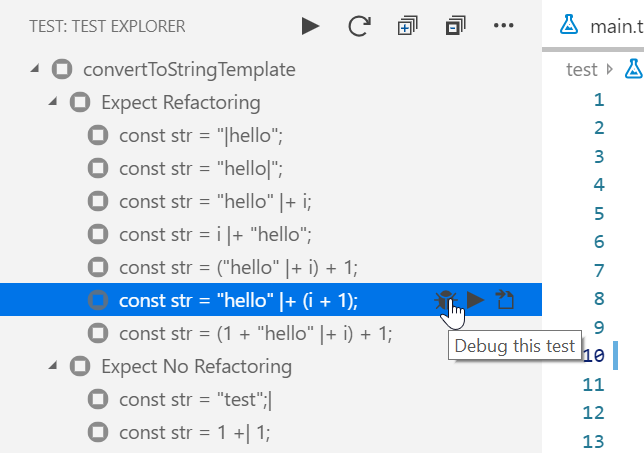

This post is about how to implement a simple refactoring for TypesScript as a language service plugin.
It features

## Goal

When I want to pass a textual message to a function, I often start with a simple string literal enquoted in `"` but then notice that I want to include non-static variables.
However, rather than just concatenating the various string parts, I prefer to use string templates for that.
The goal of this post is to implement a refactoring that can convert from manually concatenated strings to string templates:

```ts
format("Hello " + name);
// --- Refactor "Convert to template string" --->
format(`Hello ${name}`);
```

## Figuring out how to write a language service plugin

I used [Writing a Language Service Plugin](https://github.com/microsoft/TypeScript/wiki/Writing-a-Language-Service-Plugin) as a starting point for a language service plugin.
With the help of autocompletion, I soon spotted `getApplicableRefactors` and `getEditsForRefactor` as the two functions to override for custom refactorings.

By using `getProgram` of the underlying lanugage service, the plugin can access the current syntax tree and the type checker.

I ended with the following structure:

```ts
// src/index.ts: Entry point of the plugin, automatically loaded by the language server.
import * as ts_module from "typescript/lib/tsserverlibrary";
import { createDecoratedLanguageService } from "./createDecoratedLanguageService";

export = function init(modules: { typescript: typeof ts_module }) {
    return {
        // is called by TypeScript to get the decorated language service
        create(info: ts.server.PluginCreateInfo): ts.LanguageService {
            return createDecoratedLanguageService(info.languageService);
        }
    };
};
```

```ts
// src/createDecoratedLanguageService.ts
import * as ts from "typescript";
import { RefactoringLanguageService } from "./RefactoringLanguageService";

// Merges data from the underlying language service and our own refactoring service
export function createDecoratedLanguageService(
    base: ts.LanguageService
): ts.LanguageService {
    const service = new RefactoringLanguageService(base);

    return {
        ...base,
        getApplicableRefactors: (...args) => {
            const existing = base.getApplicableRefactors(...args);
            const ours = service.getApplicableRefactors(...args);
            return [...ours, ...existing];
        },
        getEditsForRefactor: (...args): ts.RefactorEditInfo | undefined => {
            return (
                base.getEditsForRefactor(...args) ||
                service.getEditsForRefactor(...args)
            );
        }
    };
}
```

```ts
// src/RefactoringLanguageService.ts: Home of the actual refactoring logic
export class RefactoringLanguageService {
    constructor(private readonly base: ts.LanguageService) {}

    getApplicableRefactors(
        fileName: string,
        positionOrRange: number | ts.TextRange,
        preferences: ts.UserPreferences | undefined
    ): ts.ApplicableRefactorInfo[] {
        const p = base.getProgram();
        // todo
    }

    getEditsForRefactor(
        fileName: string,
        formatOptions: ts.FormatCodeSettings,
        positionOrRange: number | ts.TextRange,
        refactorName: string,
        actionName: string,
        preferences: ts.UserPreferences | undefined
    ): ts.RefactorEditInfo | undefined {
        const p = base.getProgram();
        // todo
    }
}
```

## Figuring out how to test the plugin

When programming against a very large and not very well documented API such as TypeScripts compiler API,
it is important to be able to test things quickly. Besides, it is very useful to have an easy way to attach a debugger.
I can recommend using Mocha and the Mocha Test Explorer for VS Code, which allows to run and debug arbitrary tests with a single click.

For testing, we need to mock a language service host, so we can easily define virtual TypeScript files.
We also want to have a way to specifiy markers in our virtual files
so we don't have to compute positions where to apply the refactoring by ourselves.
This can be implemented in a way so that the actual tests can be expressed like this:

```ts
// test/main.ts
import { createDecoratedLanguageService } from "../src/createDecoratedLanguageService";
import { MockLanguageServiceHost } from "./MockLanguageServiceHost";
import { stripMarkers, applyTextChange } from "./utils";
import {
    convertStringConcatenationToStringTemplate,
    refactoringName
} from "../src/RefactoringLanguageService";

describe("Refactoring", () => {
    it("should refactor correctly", async () => {
        const action = {
            refactoringName,
            actionName: convertStringConcatenationToStringTemplate
        };

        // `|` is used as marker where the language service is asked for refactorings.
        testSingleFileService(
            `const str = "|hello";`,
            expectRefactored(action, "const str = `hello`;")
        );
        testSingleFileService(
            `const str = "hello" |+ (i + 1);`,
            expectRefactored(action, "const str = `hello${(i + 1)}`;")
        );
        testSingleFileService(
            `const str = ("hello" |+ i) + 1;`,
            expectRefactored(action, "const str = `hello${i}${1}`;")
        );
        testSingleFileService(
            `const str = (1 + "hello" |+ i) + 1;`,
            expectNotRefactored(refactoringName)
        );
    });
});

// ...
```

## Implementing the plugin

In this phase it is extremely useful to have hot reloading and a way to easily attach a debugger.
`@hediet/node-reload` is a library that provides a fully featured hot reloading solution for Node JS.
[The Mocha Test Explorer Extension](https://marketplace.visualstudio.com/items?itemName=hbenl.vscode-mocha-test-adapter) for VS Code provides an easy way to debug mocha tests:



Alternatively, you can use my library easy-attach that works even without VS Code.

Equipped with hot reloading, the core class now looks like this:

```ts
// src/RefactoringLanguageService.ts
import * as ts from "typescript";
import {
    hotClass,
    enableHotReload,
    registerUpdateReconciler
} from "@hediet/node-reload";

enableHotReload({ entryModule: module });
// Automatically reloads the new module when it changed
registerUpdateReconciler(module);

// Marks all methods of the class as hot.
// Hot methods are automatically restarted
// when they have been changed while being executed.
@hotClass(module)
export class RefactoringLanguageService {
    constructor(private readonly base: ts.LanguageService) {}

    getApplicableRefactors(
        fileName: string,
        positionOrRange: number | ts.TextRange,
        preferences: ts.UserPreferences | undefined
    ): ts.ApplicableRefactorInfo[] {
        const p = this.base.getProgram();
        if (!p) return [];
        // todo
        debugger;
        return [];
    }

    getEditsForRefactor(
        fileName: string,
        formatOptions: ts.FormatCodeSettings,
        positionOrRange: number | ts.TextRange,
        refactorName: string,
        actionName: string,
        preferences: ts.UserPreferences | undefined
    ): ts.RefactorEditInfo | undefined {
        const p = this.base.getProgram();
        if (!p) return undefined;
        // todo
        debugger;
        return undefined;
    }
}
```

For hot reloading to work with TypeScript, `tsc` must be started in watch mode (or alternatively `ts-node` can be used).

At this point, we can already start debugging the tests.
As you can see, if the currently executed method is changed, it is simply reexecuted when continuing.
This is almost like an inline playground for refactorings:


The actual implementation is easy now.
In `getApplicableRefactors`, all actions must be listed that can be invoked at that position.
`getEditsForRefactor` then computes how a given action affects the source code.

For our refactoring, we need to find out which AST leaf is at `positionOrRange`,
then we navigate the AST tree upwards until we are not in a binary expression anymore.
If the very left node of the last binary expression is a string, we can suggest to convert that expression tree to a single template string.

## Distribute the plugin through a VS Code Extension

This is especially easy when the VS Code extension and the language server plugin are organized in a yarn workspace.
Simply add a `typescriptServerPlugins` key to the `contributes` section of the `package.json` of your VS Code extension. The name refers to the name of the plugin's `package.json`.

```json
{
    // ...
    "contributes": {
        "typescriptServerPlugins": [
            {
                "enableForWorkspaceTypeScriptVersions": true,
                "name": "@hediet/ts-refactoring-lsp"
            }
        ]
    }
    // ...
}
```
