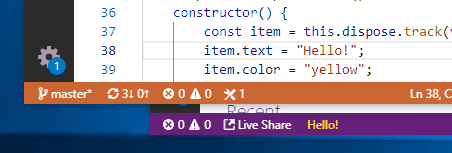
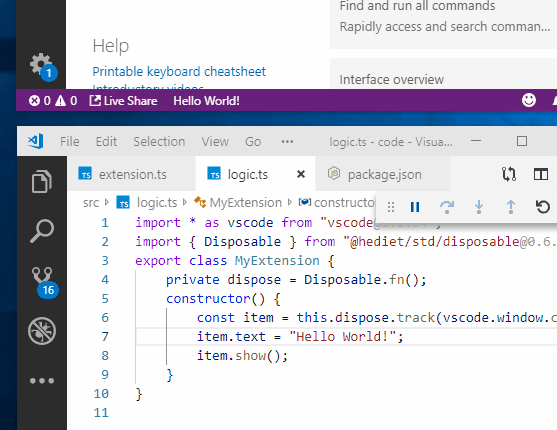

# Hot Reload for VS Code Extension Development



Ever wanted to iteratively tweak your VS Code extension but got annoyed
on how long it takes to iterate? Then check out `@hediet/node-reload`!

## Setting up a new VS Code Extension

Create a new (preferrably TypeScript) extension for vscode with `yo`:

```sh
yo code
```

Then install `@hediet/node-reload` and `@hediet/std`:

```sh
yarn add @hediet/node-reload @hediet/std
```

Delete everything inside `src` and create an empty `extension.ts`.
For demoing add `"*"` to the `activationEvents` in `package.json` so that the extension gets loaded at startup. This is not considered good practice for production as it slows down VS Code if too many extension are loaded when VS Code starts.

## Simple Hot Reload with `hotRequire`

In the simplest scenario, the hot reload logic is put into `extension.ts` (which is loaded by VS Code)
while the actual extension code lives in `logic.ts`.

`hotRequire` can be used to require a file and get notified when it changes.
For `hotRequire` to watch for changes, `enableHotReload` must be called before.
Since our extension is not the entry module of the process,
we should specify `entryModule` - otherwise other VS Code extension are watched for changes too.

```ts
// extension.ts
import { enableHotReload, hotRequire } from "@hediet/node-reload";

// TODO don't call `enableHotReload` on production
enableHotReload({ entryModule: module });

export function activate(context: vscode.ExtensionContext) {
    context.subscriptions.push(
        // hotRequire returns a Disposable
        // that disposes the last returned instance
        // and makes it stop watching.
        hotRequire<typeof import("./logic")>(module, "./logic", logic => {
            // This callback is called immediately
            // and whenever "./logic"
            // or one of its dependencies changes.
            // We simply instantiate our extension again on every change.
            // `dispose` is called on previously returned instances.
            return new logic.MyExtension();
        })
    );
}
```

```ts
// logic.ts
import * as vscode from "vscode";
export class MyExtension {
    constructor() {
        const item = vscode.window.createStatusBarItem();
        item.text = "Hello World!";
        item.show();
    }

    // Values returned in the callback of `hotRequire` must
    // have a `dispose` function.
    dispose() {}
}
```

With this code, every time `logic.ts` is changed, a new status bar message is created while the old ones stay.
To avoid that, we need to cleanup our stuff before a new instance of `MyExtension` is instantiated.
Luckily, `hotRequire` calls `dispose` on previously returned objects before the callback is run again:

```ts
// logic.ts
import * as vscode from "vscode";
export class MyExtension {
    private s: vscode.StatusBarItem;
    constructor() {
        this.s = vscode.window.createStatusBarItem();
        this.s.text = "Hello World!";
        this.s.show();
    }

    dispose() {
        s.dispose();
    }
}
```

With `Disposable.fn` from `@hediet/std/disposable` the dispose function can be made less awkward:

```ts
// logic.ts
import * as vscode from "vscode";
import { Disposable } from "@hediet/std/disposable";
export class MyExtension {
    dispose = Disposable.fn();
    constructor() {
        const item = this.dispose.track(vscode.window.createStatusBarItem());
        item.text = "Hello World!";
        item.show();
    }
}
```

And it simply works:



## Single File Hot Reload with `hotRequireExportedFn`

If we want to put the extension logic into the main extension file,
`hotRequireExportedFn` from `@hediet/node-reload` is the way to go.

`hotRequireExportedFn` can be used instead of `hotRequire` to load an exported function or class of the given module.
In addition to `enableHotReload`, `registerUpdateReconciler` must be called to set the update strategy for the given module.

```ts
// extension.ts
// ...

enableHotReload({ entryModule: module });
registerUpdateReconciler(module);

export function activate(context: vscode.ExtensionContext) {
    context.subscriptions.push(
        hotRequireExportedFn(
            module,
            MyExtension,
            MyExtension => new MyExtension()
        )
    );
}

export class MyExtension {
    dispose = Disposable.fn();
    constructor() {
        const item = this.dispose.track(vscode.window.createStatusBarItem());
        item.text = "Hello!";
        item.color = "yellow";
        item.show();
    }
}
```

## Outlook

This article only touched the surface of what `@hediet/node-reload` can do.
Using custom module reconcilers one can fully control how to apply changed modules
or when to let the dependants do the reconcilation.
See the docs for more information.
